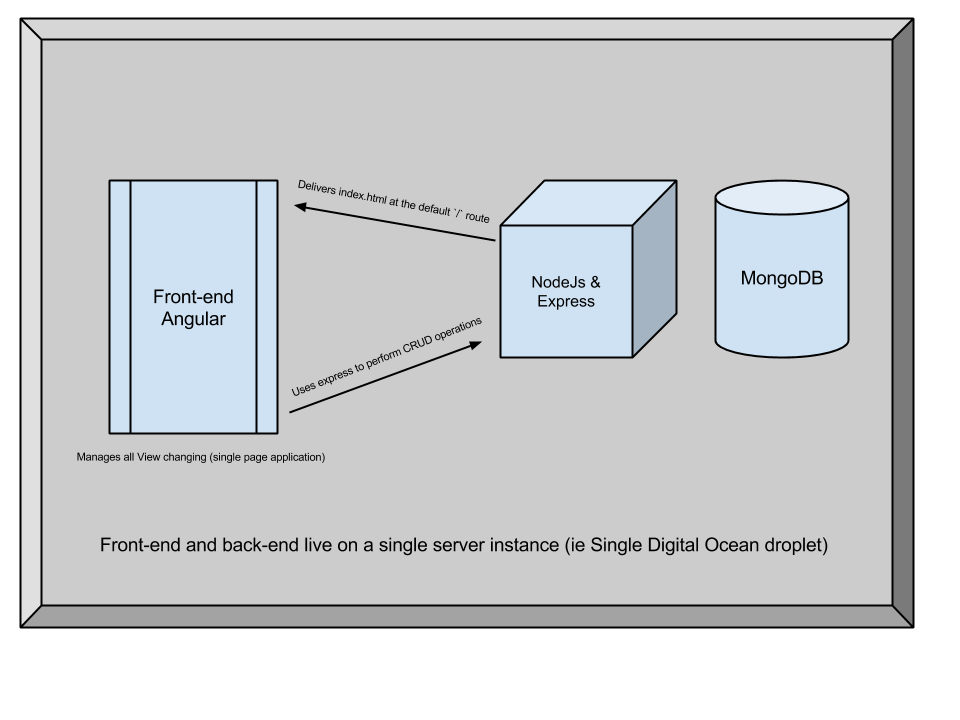

#Angular Express Seed With Authentication

This project is a great starting point for developers
who want to use Angular and Express in the same repository
as well as have Angular handle ALL of the front end work, with Express
delivering just the initial index.html file. This seed also handles Local Authentication Strategy.
Meaning basic user account creation and user login is set up for you out of the box.

#####How It Works

1.  Node handles the `GET` request for the default route http://www.mywebsite.com/
  *  Sends the main Angular HTML file to the browser
2.  All subsequent `GET` requests for views are handled by Angular routes ($routeProvider)
3.  You'll define all of your` CRUD` operation routes in your express application (routes.js)
4.  User account creation and login are built-in using passport
  *  Login at `/login`
  *  Create a new user account at `/signup`
5.  Ensure that you use the middleware function `isAuthenticated` for each of your new routes on any request that must first have an authenticated user
  *  Data that you want made to the public (without a user first loggin in) can omit the `isAuthenticated` middleware 
6.  Currently the express app assumes the database is on the localhost. You can change the URL of the Mongo database to any location.

#####Dependencies

*  Bower - bower is used to managed the front-end dependencies
*  npm - the `package.json` file lists all of the npm dependencies

#####Getting Started

1.  Clone this repo and navigate into the main directory
2.  If you don't have Bower installed run `sudo npm install bower -g`
3.  From terminal run `bower install`
4.  From terminal run `sudo npm install`
5.  Starting the app:
  *  If you want debug logging run from terminal `DEBUG=dev node main.js` or `DEBUG=dev nodemon main.js` if you use nodemon
  *  Omit `DEBUG=dev` if you don't want logging: `node main.js`
6.  Open `http://localhost:5050` in a browser to use the application - you should see the login screen
  *  Feel free to change the PORT to whatever you want (keep in mind there is no environment variables and that Angular currently uses `http://localhost:5050/` as its base URL`

#####Diagram

